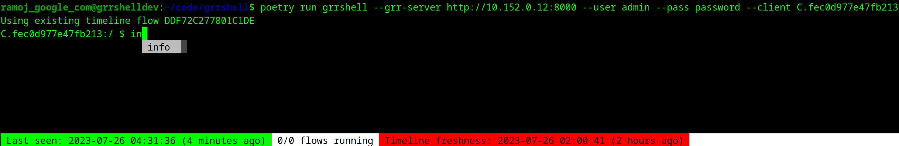

# GRR Shell

## TL;DR

GRR Shell is an interactive command line utility used for navigating a remote
client's Emulated Filesystem (EFS)[0], collecting files and launching artefact
collection flows.

[0] So named to disambiguate with the Virtual File System (VFS) in the GRR Web UI.

## Usage

Run `grrshell` as follows:

```
grrshell command [options]
```

If `command` is not provided, `shell` is assumed.

## Commands Supported

### `shell`

The primary function of GRR Shell is the interactive shell, launched by this
command. The shell uses the results of a TimelineFlow to populate an in-memory
representation of the remote filesystem, referred to as the EFS. When launching,
a Timeline is selected in the following precedence:

1.  A Timeline flow ID that is specified by the operator with the `--initial-timline` flag
2.  A Timeline flow which completed successfully on the client within the last 3 hours
3.  A new Timeline flow is launched

Based on the need for a Timeline flow **it can take a few minutes for the shell
to become usable, and #3 will only work if the client is online.**

Command options:

*   `--username` GRR username
*   `--password` GRR password
*   `--grr-server` GRR HTTP Endpoint
*   `--client` - The remote client. Supports FQDNs (eg. `ramoj.domain.com`) or GRR Client IDs (`C.abcdef0123456789`)
*   `--initial-timeline` - [Optional] Specify an existing timeline flow ID forthe host (eg, `A1B2C3D4E5F6A1B2`).
*   `--max-file-size` - [Optional] Specify a max file size for file collections. If not specified, the GRR default of `500MB` is used.

Once launched, a prompt similar to the below will be presented:



The prompt displays the Client ID followed by the current working directory.
Shell mode supports autocomplete of shell commands, and where appropriate,
remote paths (shown here) and artefact names.

Visible in the status bar of the display is the `Last seen` time for the client
(helpfully green if seen in the last 10 minutes, yellow up to a half hour, red
for longer.) Additionally, an indicator of how many flows are running in the
background, as well as the total count of flows launched is shown. Finally, the
freshness of the timeline used for the Emulated FS is also displayed (coloured
similarly to `Last Seen`).[1]

[1] As the `refresh` command allows for partial Timeline updates, this
    timestamp is the freshness of the EFS at the current working directory.

The following shell commands are supported. `[]` params are optional, `<>` are
required.

*   `help` - Display help text (also `h` and `?`.)
*   `pwd` - Print the current working directory.
*   `ls [path]` - List entries in the current working directory. `[path]` is
    optional, `./` is assumed if not specified. Wildcards `*` are supported in
    the final path component.
*   `cd <path>` - Change working directory.
*   `info <path>` - Collect information for a file (also `hash <path>`). This is
    performed by a synchronous `ClientFileFinder` flow with the `HASH` option.
    Will display MAC times, permission info, and hashes, among other things.
    Supports `ClientFileFinder` wildcards. Specifying `--ads` will also attempt
    collection of a `Zone.Identifier` alternate data stream (though this is not
    supported with wildcard paths as the flow used is `GetFile`).
*   `collect <path>` - Collect remote files. This is performed in the background
    by an asynchronous `ClientFileFinder` flow, and so supports
    `ClientFileFinder` path wildcards. Files are downloaded to the local current
    working directory, named for the client ID, and remote directory structure
    is preserved.
*   `artefact <artefact_name>` (alt spelling `artifact`) Collect an artefact via
    `ArtifactCollectorFlow`. This is performed asynchronously in the background.
    Similar to `collect`, files are downloaded to the local current working
    directory, and remote directory structure is preserved.
*   `flows` - Fetch current state of any background flows for display. If `all
    [count]` is specified, then all flows launched on the client are listed, not
    just flows from this GRR Shell session.
*   `detail <flow id>` - Fetch and display more detailed information on a flow.
*   `resume <flow id>` - (Re)attach a flow to this shell session.
    `ClientFileFinder`, `ArtifactCollectorFlow`, and `GetFile` (Zone.Identifier
    ADS only) are supported. Resuming an asynchronous flow will download the
    flow results in the background. Synchronous flows will display the flow
    result.
*   `refresh [path]` - Update the emulated filesystem with a fresh
    `TimelineFlow` (synchronous). Giving an optional path sets that path as the
    Timeline root, which can speed up flow collection. Useful if the entire
    filesystem is not required to be refreshed.
*   `find [dir] <regex>` - Search for files matching a regex pattern.
    Functionally similar to bash's `find <dir> | grep -P <regex>`. If `<dir>` is
    not specified, `./` is assumed.
*   `clear` Clear the terminal screen.
*   `exit` Exit shell (also `quit` and `<CTRL+D>`)

Additionally, `set` can be used to set shell runtime values. Currently, only one
such value is used:

*   `max-file-size` Specify a max file size for file collections. If not
    specified, the GRR default of `500MB` is used.

Note: Windows machines only have `C:/` collected by default. To collect other
volumes, use `refresh D:/` (for example.)

### `collect`

Use to collect a set of files from the remote client. This uses the GRR
`ClientFileFinder` flow, and so path wildcards available to `ClientFileFinder`
are supported.

Command options:

*   `--username` GRR username
*   `--password` GRR password
*   `--grr-server` GRR HTTP Endpoint
*   `--client` - The remote client. Supports FQDNs (eg. `ramoj.domain.com`) or GRR Client IDs (`C.abcdef0123456789`)
*   `--remote-path` - `ClientFileFinder` expression for files to collect
*   `--local_path` - Location to store the retrieved files

Remote file path structures are preserved on collection, so a command with
`--remote-path /home/ramoj/tmp/file --local-path /tmp` will result in the
collected file being available at `/tmp/home/ramoj/tmp/file`.

### `artefact`

Alt spelling `artifact`.

Collect an artefact from the client.

*   `--username` GRR username
*   `--password` GRR password
*   `--grr-server` GRR HTTP Endpoint
*   `--client` - The remote client. Supports FQDNs (eg. `ramoj.domain.com`) or GRR Client IDs (`C.abcdef0123456789`)
*   `--artefact` - Artefact definition to collect, eg, `BrowserHistory`.
*   `--local_path` - Location to store the retrieved files
